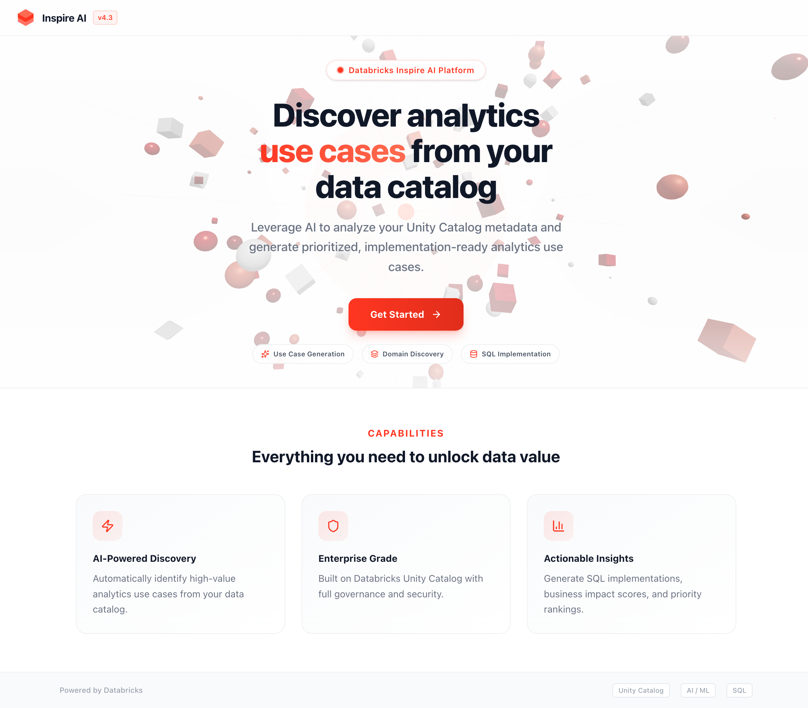
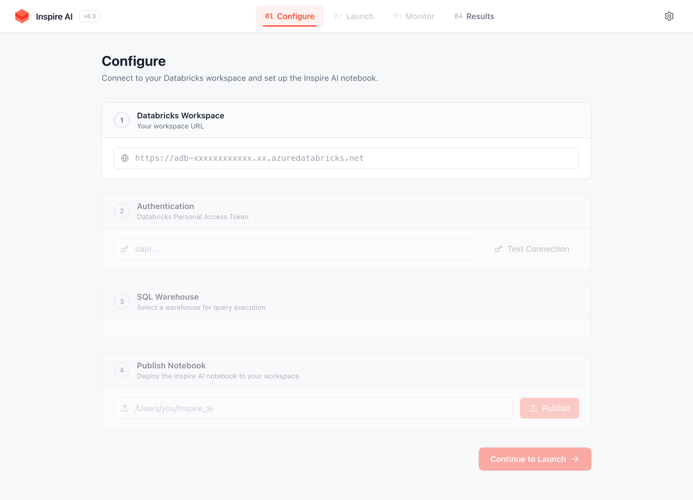
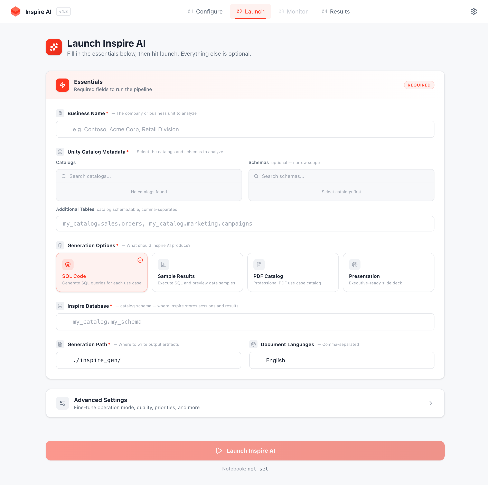
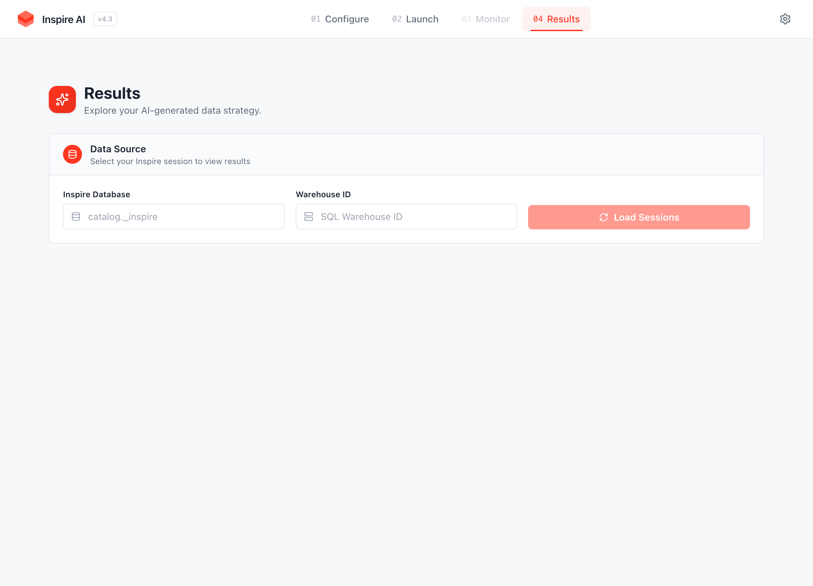

# Inspire AI — Databricks App Deployment Guide

Deploy Inspire AI as a Databricks App in any customer workspace. The app ships with the notebook bundled — no external dependencies required.

## App Screenshots

### Landing Page


### Configure — Connect to a Databricks Workspace


### Launch — Set up and run the pipeline


### Results — Explore generated use cases


---

## Prerequisites

- A Databricks workspace (Azure, AWS, or GCP)
- Databricks CLI installed and configured (`pip install databricks-cli` or `brew install databricks`)
- A Personal Access Token (PAT) with workspace admin permissions
- Node.js 18+ installed locally (for building the frontend)

---

## Quick Start (5 minutes)

### 1. Clone the repository

```bash
git clone https://github.com/mwissad/InspireApp.git
cd InspireApp
git checkout v43_final
```

### 2. Build the frontend

```bash
cd frontend
npm install
npx vite build
cd ..
```

### 3. Configure Databricks CLI

```bash
export DATABRICKS_HOST="https://<your-workspace>.azuredatabricks.net"
export DATABRICKS_TOKEN="dapi..."
```

### 4. Create the Databricks App

```bash
databricks apps create inspire-ai \
  --description "Inspire AI - Data Strategy Copilot powered by Databricks"
```

> Wait for the app compute to become ACTIVE:
> ```bash
> databricks apps get inspire-ai
> ```

### 5. Prepare deployment files

Create a clean deployment directory with only the required files:

```bash
mkdir -p /tmp/inspire-deploy/backend /tmp/inspire-deploy/frontend/dist

# Backend
cp backend/server.js /tmp/inspire-deploy/backend/
cp backend/package.json /tmp/inspire-deploy/backend/
cp backend/package-lock.json /tmp/inspire-deploy/backend/
cp backend/dbc_bundle.js /tmp/inspire-deploy/backend/

# Frontend (pre-built)
cp -r frontend/dist/* /tmp/inspire-deploy/frontend/dist/

# App config
cp app.yaml /tmp/inspire-deploy/
cp start.sh /tmp/inspire-deploy/
```

### 6. Upload and deploy

```bash
# Upload to workspace
databricks workspace import-dir /tmp/inspire-deploy \
  "/Workspace/Users/<your-email>/inspire-ai" --overwrite

# Deploy
databricks apps deploy inspire-ai \
  --source-code-path "/Workspace/Users/<your-email>/inspire-ai"
```

### 7. Verify

```bash
databricks apps get inspire-ai
```

The app URL will be displayed in the output, e.g.:
```
https://inspire-ai-<workspace-id>.<region>.databricksapps.com
```

---

## Using the App

### Step 1: Configure (Settings)

1. Open the app URL in your browser
2. Click **Get Started** on the landing page
3. In the **Configure** tab, enter:
   - **Databricks Host**: Your customer's workspace URL (e.g. `https://adb-xxxx.xx.azuredatabricks.net`)
   - **Access Token**: A PAT from the customer's workspace
   - Click **Test Connection** to verify
4. Select a **SQL Warehouse** from the dropdown
5. Click **Publish Notebook** — this deploys the Inspire notebook to the customer's workspace
   - The notebook path will be auto-filled after publishing

### Step 2: Launch

1. Go to the **Launch** tab
2. Fill in the **Essentials**:
   - **Business Name**: The company or business unit name (e.g. "Acme Corp")
   - **Unity Catalog Metadata**: Select catalogs and/or schemas to analyze
   - **Inspire Database**: The `catalog.schema` where Inspire stores its data (e.g. `main._inspire`)
   - **Generation Options**: Choose what to generate (SQL Code, Sample Results, PDF, Presentation)
   - **Generation Path**: Where to write output artifacts (default: `./inspire_gen/`)
3. Optionally expand **Advanced Settings** to fine-tune:
   - Operation mode, table election strategy, quality level
   - Strategic goals, business domains, business priorities
   - SQL per domain, custom session ID
4. Click **Launch Inspire AI**

> **First run note**: The Inspire database tables (`__inspire_session`, `__inspire_step`) will be created automatically on first run. If you have tables from a previous version (v41), drop them first:
> ```sql
> DROP TABLE IF EXISTS <catalog>.<schema>.__inspire_session;
> DROP TABLE IF EXISTS <catalog>.<schema>.__inspire_step;
> ```

### Step 3: Monitor

1. The **Monitor** tab shows real-time pipeline progress
2. Use the left sidebar to filter by **stage**
3. Use status pills (Running, Complete, Error) to filter steps
4. Search for specific steps, expand rows for details
5. Auto-scroll keeps you at the latest step

### Step 4: Results

1. The **Results** tab loads automatically when the pipeline completes
2. Use the left sidebar to filter by **domain**
3. Filter by priority, type, or search by keyword
4. Expand any use case card to see:
   - Problem statement and proposed solution
   - Business value and priority alignment
   - Technical design and SQL implementation
5. **Export JSON** to download the filtered results

---

## Architecture

```
┌─────────────────────────────────────────────┐
│              Databricks App                  │
│  ┌────────────┐    ┌──────────────────────┐ │
│  │  React UI  │───▶│  Express Backend     │ │
│  │  (static)  │    │  - /api/inspire/*    │ │
│  └────────────┘    │  - DBC bundle        │ │
│                    │  - Notebook publish   │ │
│                    └──────────┬───────────┘ │
└───────────────────────────────┼─────────────┘
                                │
                    ┌───────────▼───────────┐
                    │  Customer Workspace    │
                    │  - SQL Warehouse API   │
                    │  - Jobs API            │
                    │  - Unity Catalog API   │
                    │  - Workspace API       │
                    └───────────────────────┘
```

- The **frontend** is a pre-built React SPA served as static files
- The **backend** (Express/Node.js) proxies API calls to the customer's Databricks workspace
- The **DBC notebook** is embedded as base64 in `backend/dbc_bundle.js` and materialized at runtime
- Authentication uses the customer's PAT token entered in the UI (passed via `X-DB-PAT-Token` header to survive the Databricks App proxy)

---

## Deployment to a Different Customer

The same app can connect to **any** Databricks workspace. Simply:

1. Open the app
2. In **Configure**, enter the new customer's workspace URL and PAT
3. Publish the notebook to their workspace
4. Launch the pipeline

No redeployment needed — the app is workspace-agnostic.

---

## Troubleshooting

| Issue | Solution |
|-------|----------|
| "Invalid token" on Configure | Ensure the PAT is valid and has workspace access. Databricks Apps proxy strips the `Authorization` header — the app uses `X-DB-PAT-Token` instead. |
| "Bundled DBC file not found" | The `backend/dbc_bundle.js` file is missing from the deployment. Re-run step 5 above. |
| Build fails during deployment | Ensure `frontend/dist/` exists (run `npx vite build` first). The app does NOT build the frontend at deploy time. |
| DELTA_MERGE_UNRESOLVED_EXPRESSION | Old v41 tables exist. Drop `__inspire_session` and `__inspire_step` tables and re-run. |
| App shows blank page | Check that `frontend/dist/` was uploaded. Run `databricks workspace list "/Workspace/Users/<email>/inspire-ai/frontend/dist"` to verify. |

---

## File Structure

```
inspire-ai/
├── app.yaml                    # Databricks App entry point
├── start.sh                    # Startup script (installs deps + starts server)
├── backend/
│   ├── server.js               # Express API server
│   ├── package.json            # Backend dependencies
│   ├── package-lock.json
│   └── dbc_bundle.js           # Embedded DBC notebook (base64)
└── frontend/
    └── dist/                   # Pre-built React app
        ├── index.html
        └── assets/
            ├── index-*.js
            ├── index-*.css
            └── HeroScene3D-*.js
```

---

## Version

- **App Version**: v4.3
- **Notebook**: `databricks_inspire_v43.dbc`
- **Stack**: React 19 + Vite 7 + Tailwind CSS 4 (frontend), Express 5 + Node.js (backend)
