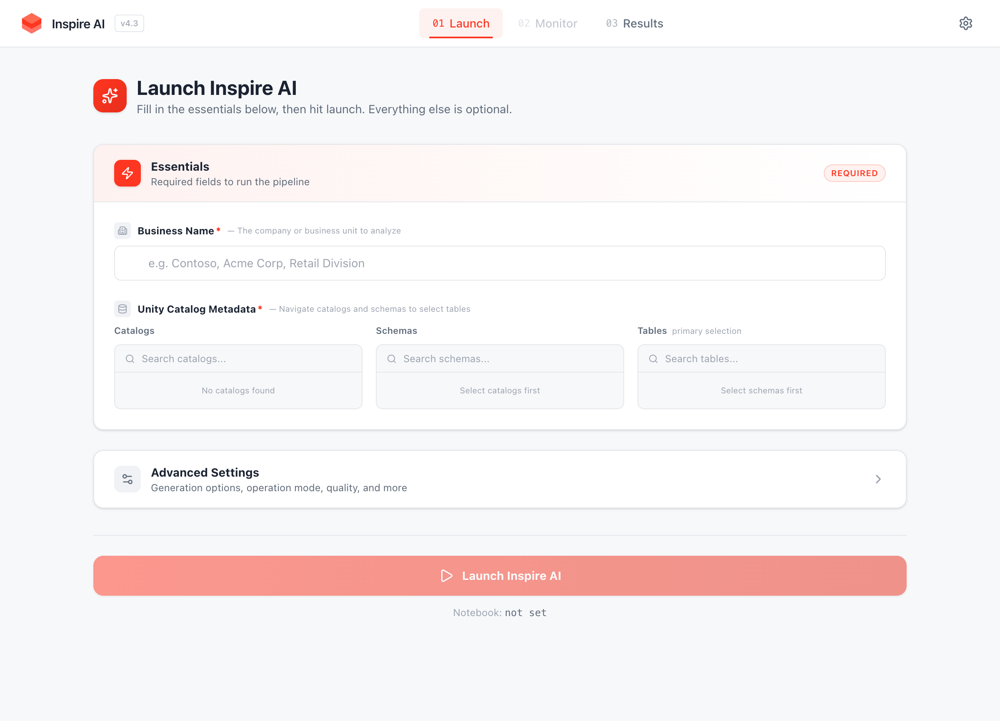
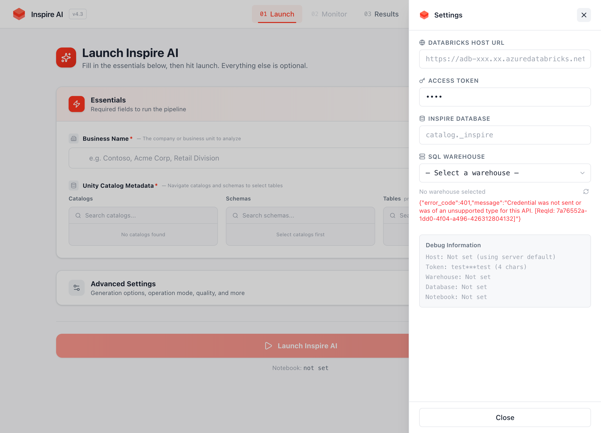
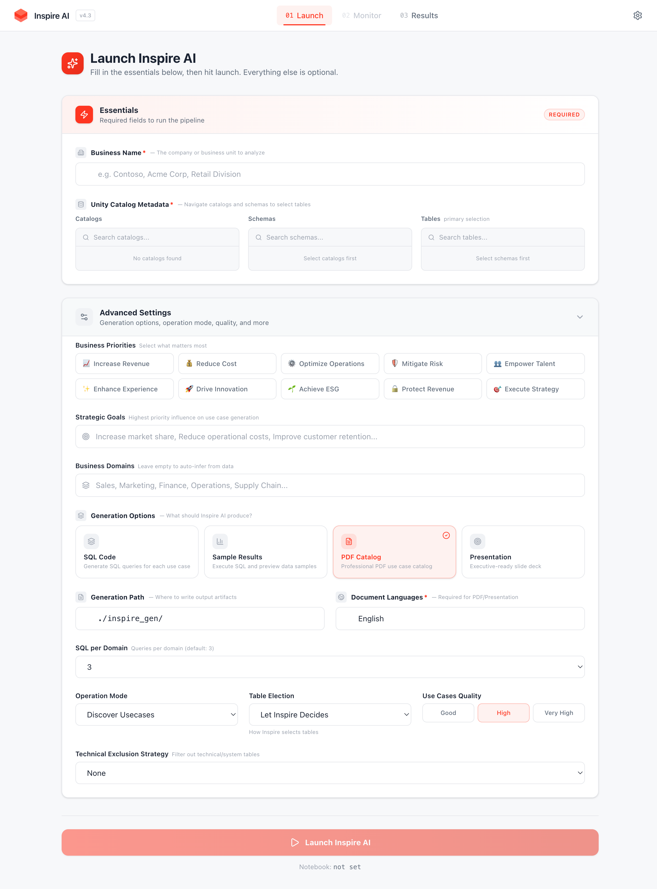
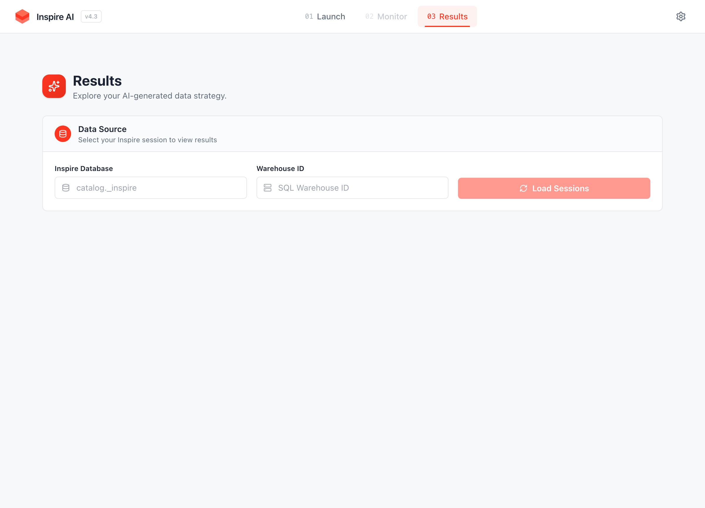

# Inspire AI v4.3 — Data Strategy Copilot

> **Turn your data catalog into an actionable analytics strategy — powered by AI and Databricks.**

Inspire AI scans your Unity Catalog tables, understands their structure and relationships, and generates a comprehensive data strategy with prioritized use cases, SQL implementations, and business impact assessments — all in minutes, not months.

---

## App Preview

### Landing Page — 3D animated hero with Databricks branding


### Launch — Simplified essentials (Business Name + Unity Catalog)


### Settings — Live warehouse selector with status badges


### Advanced Settings — Generation options, operation mode, and more


### Results — Explore generated use cases with domain filtering


---

## What's New in v4.3

| Change | Details |
|--------|---------|
| **Simplified Launch Page** | Only Business Name and Unity Catalog Metadata are required upfront — everything else moved to Advanced Settings |
| **Live Warehouse Selector** | Settings panel now shows a dropdown with real-time warehouse status (RUNNING/STOPPED/STARTING) and color-coded badges |
| **Seamless Notebook Publishing** | Notebook auto-publishes to `/Shared/inspire_ai` — no manual configuration needed |
| **Collapsible Pipeline Monitor** | Detailed steps view is now an expandable "Advanced" accordion, collapsed by default |
| **Databricks App Deployment** | Deploy as `inspire-ai-v43` with one command — ready for customer demos |
| **Removed Features** | Unstructured data + dashboards features removed; AI model widget removed; model cascade uses (type, size) pairs |

---

## Architecture

```
┌─────────────────────────────────────────────────┐
│  Frontend  (React 19 · Vite · Tailwind CSS v4)  │
│  Glow UI — Databricks brand design system       │
├────────────────────┬────────────────────────────┤
│  Static assets     │  Backend (Express 5 · Node) │
│  served by backend │  • Databricks REST API proxy │
│  in production     │  • SQL Statement API bridge  │
│                    │  • Auto notebook publish      │
└────────────────────┴──────────┬─────────────────┘
                                │
                   ┌────────────▼────────────┐
                   │    Databricks Workspace   │
                   │  • Unity Catalog metadata │
                   │  • SQL Warehouse (compute) │
                   │  • /Shared/inspire_ai      │
                   │  • _inspire session tables  │
                   └────────────────────────────┘
```

---

## Deploy as a Databricks App

### Quick Start

```bash
# 1. Clone & checkout
git clone https://github.com/mwissad/InspireApp.git
cd InspireApp
git checkout v43_newfeatures_fix

# 2. Build frontend
cd frontend && npm install && npx vite build && cd ..

# 3. Authenticate Databricks CLI
databricks auth login \
  --host "https://<your-workspace>.azuredatabricks.net" \
  --profile inspire-deploy

# 4. Create the app (first time only)
databricks apps create inspire-ai-v43 \
  --description "Inspire AI v4.3 - Data Strategy Copilot" \
  -p inspire-deploy

# 5. Sync files to workspace (excludes node_modules automatically)
databricks sync . "/Workspace/Users/<your-email>/inspire-ai-v43" \
  --exclude node_modules \
  --exclude .venv \
  --exclude __pycache__ \
  --exclude .git \
  --exclude "frontend/src" \
  --exclude "frontend/public" \
  -p inspire-deploy

# 6. Upload built frontend
databricks workspace import-dir frontend/dist \
  "/Workspace/Users/<your-email>/inspire-ai-v43/frontend/dist" \
  --overwrite \
  -p inspire-deploy

# 7. Deploy
databricks apps deploy inspire-ai-v43 \
  --source-code-path "/Workspace/Users/<your-email>/inspire-ai-v43" \
  -p inspire-deploy
```

Your app will be available at: `https://inspire-ai-v43-<workspace-id>.<region>.databricksapps.com`

> For a full step-by-step guide with troubleshooting, see **[DEPLOYMENT_GUIDE.md](DEPLOYMENT_GUIDE.md)**.

### Run Locally (Development)

```bash
# 1. Install dependencies
cd frontend && npm install && cd ../backend && npm install && cd ..

# 2. Configure backend env
cat > backend/.env << 'EOF'
DATABRICKS_HOST=https://<your-workspace>.azuredatabricks.net
DATABRICKS_TOKEN=dapi...
PORT=8080
EOF

# 3. Start backend
cd backend && node server.js &

# 4. Start frontend (with proxy to backend)
cd frontend && npx vite
```

- **Frontend** -> [http://localhost:5173](http://localhost:5173) (proxies `/api` to backend)
- **Backend** -> [http://localhost:8080](http://localhost:8080)

---

## How to Use

### Step 1: Launch
1. Click **Get Started** on the landing page
2. Enter the **Business Name** (e.g. "Acme Corp")
3. Browse **Unity Catalog** — select catalogs, schemas, and tables to analyze
4. (Optional) Expand **Advanced Settings** to configure generation options, priorities, domains, etc.
5. Click **Launch Inspire AI**

> The notebook is auto-published to `/Shared/inspire_ai` — no manual setup needed.

### Step 2: Configure (Settings Panel)
Click the **Settings** gear icon in the header to:
- Set the **Databricks Host URL** and **Access Token** for the target workspace
- Select a **SQL Warehouse** from the live dropdown (shows RUNNING/STOPPED status)
- Set the **Inspire Database** (e.g. `catalog._inspire`) for session tracking

### Step 3: Monitor
- Watch real-time pipeline progress with the summary bar (stages, steps, errors)
- Expand the **Advanced** accordion to see detailed step-by-step execution with stage filtering and search

### Step 4: Results
- Browse generated use cases by **domain**, **priority**, and **type**
- Expand cards for problem statements, solutions, SQL, and business value
- **Export JSON** for downstream use

> **First run note**: If upgrading from v41, drop existing tables first:
> ```sql
> DROP TABLE IF EXISTS <catalog>.<schema>.__inspire_session;
> DROP TABLE IF EXISTS <catalog>.<schema>.__inspire_step;
> ```

---

## Features

| Feature | Description |
|---------|-------------|
| **3D Landing Page** | Three.js animated hero with Databricks red cubes and particles |
| **Simplified Launch** | Only Business Name + Unity Catalog required — everything else in Advanced Settings |
| **Live Warehouse Selector** | Dropdown with real-time status badges (RUNNING, STOPPED, STARTING) |
| **Seamless Notebook Publish** | Auto-publishes to `/Shared/inspire_ai` on first run — zero configuration |
| **Collapsible Monitor** | Pipeline details in an expandable accordion — clean overview by default |
| **Multi-workspace** | Connect to any customer workspace via PAT — no redeployment needed |
| **Real-time Monitoring** | Live step tracking with stage sidebar, status pills, and search |
| **Domain Filtering** | Left sidebar for domain-based filtering on Monitor and Results pages |
| **Priority Sorting** | Filter and sort use cases by Ultra High, Very High, High, Medium, Low |
| **SQL Implementation** | Generated SQL queries with syntax highlighting and table resolution |
| **JSON Export** | Download filtered results for reporting or integration |
| **Databricks App Ready** | Deploy with `app.yaml` + `start.sh` — runs on Databricks Apps platform |

---

## Configuration

All configuration is done through the UI (Settings panel) or environment variables:

| Setting | Where | Description |
|---------|-------|-------------|
| Databricks Host | Settings panel + env `DATABRICKS_HOST` | Target workspace URL |
| Access Token | Settings panel (passed via `X-DB-PAT-Token` header) | Workspace PAT token |
| SQL Warehouse | Settings panel (live dropdown) | For query execution |
| Inspire Database | Settings panel | `catalog.schema` for session tracking |
| Notebook Path | Auto-managed (`/Shared/inspire_ai`) | Where Inspire notebook is published |

---

## Project Structure

```
InspireApp/
├── app.yaml                     # Databricks App manifest
├── start.sh                     # Production startup script
├── DEPLOYMENT_GUIDE.md          # Full deployment & troubleshooting guide
├── package.json                 # Root scripts (dev, build, start)
├── databricks_inspire_v43.dbc   # Original DBC notebook file (v4.3)
├── backend/
│   ├── server.js                # Express API — Databricks proxy, SQL bridge, auto notebook publish
│   ├── dbc_bundle.js            # Embedded DBC notebook (base64)
│   └── package.json             # Backend dependencies
├── frontend/
│   ├── src/
│   │   ├── App.jsx              # Root component, routing, auto-config, ErrorBoundary
│   │   ├── index.css            # Tailwind v4 theme (Glow design system)
│   │   ├── components/
│   │   │   ├── Header.jsx       # Navigation bar with step indicators
│   │   │   ├── HeroScene3D.jsx  # Three.js 3D animated landing scene
│   │   │   ├── SettingsPanel.jsx # Side panel — warehouse selector, config fields
│   │   │   └── DatabricksLogo.jsx
│   │   └── pages/
│   │       ├── LandingPage.jsx  # 3D hero + onboarding
│   │       ├── LaunchPage.jsx   # Simplified essentials + advanced accordion
│   │       ├── MonitorPage.jsx  # Real-time tracker with collapsible details
│   │       └── ResultsPage.jsx  # Use-case catalog browser
│   └── vite.config.js           # Vite + React + Tailwind v4 + API proxy
├── docs/screenshots/            # App screenshots for documentation
└── notebooks/                   # Extracted notebook source files
```

---

## Tech Stack

| Layer | Technology |
|-------|-----------|
| Frontend | React 19, Vite 7, Tailwind CSS v4, Three.js |
| Icons | Lucide React |
| Backend | Express 5, Node.js 18+ |
| Deployment | Databricks App (`app.yaml`) |
| Notebook | Databricks .dbc v4.3 (Python) |
| API | Databricks REST API, SQL Statement API |

---

## API Endpoints

All endpoints accept `X-DB-PAT-Token` header for authentication.
The `X-Databricks-Host` header specifies the target workspace.

| Method | Endpoint | Description |
|--------|----------|-------------|
| `GET` | `/api/health` | Health check + configuration status |
| `GET` | `/api/me` | Current user info |
| `GET` | `/api/warehouses` | List SQL warehouses with status |
| `GET` | `/api/notebook` | Auto-publish notebook to `/Shared/inspire_ai` |
| `GET` | `/api/catalogs` | List Unity Catalog catalogs |
| `GET` | `/api/catalogs/:c/schemas` | List schemas in a catalog |
| `GET` | `/api/tables/:c/:s` | List tables with metadata |
| `POST` | `/api/publish` | Manually publish Inspire notebook (.dbc) |
| `POST` | `/api/run` | Submit a notebook run |
| `GET` | `/api/run/:id` | Get run status |
| `GET` | `/api/inspire/session` | Poll session status |
| `GET` | `/api/inspire/sessions` | List all sessions |
| `GET` | `/api/inspire/steps` | Get step progress |
| `GET` | `/api/inspire/results` | Get results JSON |

---

## License

Proprietary — provided under the terms of the customer engagement agreement.
